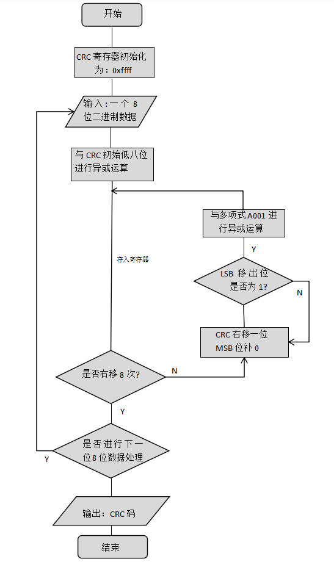

## CRC校验的作用与意义：

​	**CRC 校验——循环冗余校验码（Cyclic Redundancy Check）：CRC 校验是一种数据算法，是用来校验数据对错的。CRC 校验函数把`一帧数据除最后两个字节外，前边所有的字节进行特定的算法计算`，计算完后生成了一个 16bit 的数据，作为CRC 校验码，添加在一帧数据的最后。接收方接收到数据后，同样会把前边的字节进行 CRC 计算，计算完了再和发过来的16bit 的 CRC 数据进行比较，如果相同则认为数据正常，没有出错，如果比较不相同，则说明数据在传输中发生了错误，这帧数据将被丢弃，就像没收到一样， 而发送方会在得不到回应后做相应的处理错误处理。**


## CRC-16校验计算流程图：



## CRC-16算法说明：

* 1) 设置CRC寄存器初始值**`0xFFFF`**

* 2) 将数据的第一个8-bit字符与16位CRC寄存器的**`低8位进行异或`**，并把结果存入CRC寄存器

* 3) 检查当前**`移除的LSB位`**数值

* 4) CRC寄存器**右移一位，MSB补零**

* 5) 若LSB为**1**，CRC寄存器**与多项式码相异或**

* 6) 重复第3至第5步**直到8次**移位全部完成，一个8-bit数据处理完毕

* 7) 重复第2至第6步直到所有数据全部处理完成

* 8) 最终CRC寄存器的内容即为CRC值

## 算法过程演示：
|               |              |
| --------------- | ------------------------------------- |
| **首个数据初始化CRC:0xffff** | 1 1 1 1    1 1 1 1    1 1 1 1    1 1 1 1 |
| 输入第一个数据**0x0e** | 0 0 0 0     1 1 1 0 |
| 异或运算 | 1 1 1 1    1 1 1 1    1 1 1 1    0 0 0 1 |
| 右移一位①，移除位为1 | 0 1 1 1    1 1 1 1    1 1 1 1    1 0 0 0 |
| 与A001异或 | 1 0 1 0    0 0 0 0    0 0 0 0    0 0 0 1 |
|  | 1 1 0 1    1 1 1 1    1 1 1 1    1 0 0 1 |
| 右移一位②，移除位为1 | 0 1 1 0    1 1 1 1    1 1 1 1    1 1 0 0 |
| 与A001异或 | 1 0 1 0    0 0 0 0    0 0 0 0    0 0 0 1 |
|  | 1 1 0 0    1 1 1 1    1 1 1 1    1 1 0 1 |
| 右移一位③，移除位为1 | 0 1 1 0    0 1 1 1    1 1 1 1    1 1 1 0 |
| 与A001异或 |1 0 1 0    0 0 0 0    0 0 0 0    0 0 0 1|
|             |1 1 0 0    0 1 1 1    1 1 1 1    1 1 1 1|
| 右移一位④，移除位为1 |0 1 1 0    0 0 1 1    1 1 1 1    1 1 1 1|
| 与A001异或 | 1 0 1 0    0 0 0 0    0 0 0 0    0 0 0 1  |
|              |1 1 0 0    0 0 1 1    1 1 1 1    1 1 1 0|
| 右移一位⑤，移除位为0 |0 1 1 0    0 0 0 1    1 1 1 1    1 1 1 1|
| 右移一位⑥，移除位为1 |0 0 1 1    0 0 0 0    1 1 1 1    1 1 1 1|
| 与A001异或 |1 0 1 0    0 0 0 0    0 0 0 0    0 0 0 1|
|         |1 0 0 1    0 0 0 0    1 1 1 1    1 1 1 0|
| 右移一位⑦，移除位为0 |0 1 0 0    1 0 0 0     0 1 1 1    1 1 1 1|
| 右移一位⑧，移除位为1 |0 0 1 0    0 1 0 0     0 0 1 1    1 1 1 1|
| 与A001异或 |1 0 1 0    0 0 0 0    0 0 0 0    0 0 0 1|
| **作第二个数据的初始化CRC** |1 0 0 0    0 1 0 0    0 0 1 1    1 1 1 0|
| 所有数据计算完成，输出CRC |8              4              3              E|
| CRC位置**反序**获得终值 |**3E                             84**|

#### 多值计算

**例：计算数据`0e 3b`**

```
将首个数据**0e**进行计算，右移8次后将值作为第二个数据**3b** 的初始校验CRC，继续计算直至右移8次，最终结果反序后为CRC值：44 03
```

**例：潜江设备的数据查询指令：`08 03 00 00 00 06 C5 51`**

```
先以ffff作初始化值计算08的校验值，作为03的初始化CRC值，其结果在作为00的初始化CRC值，以此类推，直至计算最后一个数据06完成，所得的最终值反序后为：C5 51
```


*CRC在线计算工具：<http://www.ip33.com/crc.html>*


## 算法代码：

**C++案例**

```c++
#include 
using namespace std;
const int POLY=0xa001;

/*@para addr,start of data
 *@para num,length of data
 *@para crc,incoming CRC
**/
unsigned int crc16(unsigned char *addr,int num,unsigned int crc){
    for(;num > 0;num--)
    {
        crc = crc^(*addr++);
        for(int i = 0;i<8;i++)
        {
            if(crc & 0x0001)
                crc = (crc>>1)^POLY;
            else
                crc >>= 1;
        }
    }
    return(crc);
}

void main(void){    
    unsigned char data[] = {0x01,0x0f,0x00,0x00,0x00,0x0c};
    unsigned int c = crc16(data,6,0xffff);
```

**C代码**

```c

#include "stdafx.h"
 
typedef unsigned char uint8_t;
typedef unsigned short uint16_t;
const uint16_t polynom = 0xA001;
 
uint16_t crc16bitbybit(uint8_t *ptr, uint16_t len){
	uint8_t i;
	uint16_t crc = 0xffff;
 
	if (len == 0) {
		len = 1;
	}
	while (len--) {
		crc ^= *ptr;
		for (i = 0; i<8; i++)
		{
			if (crc & 1) {
				crc >>= 1;
				crc ^= polynom;
			}
			else {
				crc >>= 1;
			}
		}
		ptr++;
	}
	return(crc);
}
```

**python代码**

```python
def crc16(x, invert):
    a = 0xFFFF
    b = 0xA001
    for byte in x:
        a ^= ord(byte)
        for i in range(8):
            last = a % 2
            a >>= 1
            if last == 1:
                a ^= b
    s = hex(a).upper()
    return s[4:6]+s[2:4] if invert == True else s[2:4]+s[4:6]
print(crc16("01234",True))
print(crc16("01234",False))
```

